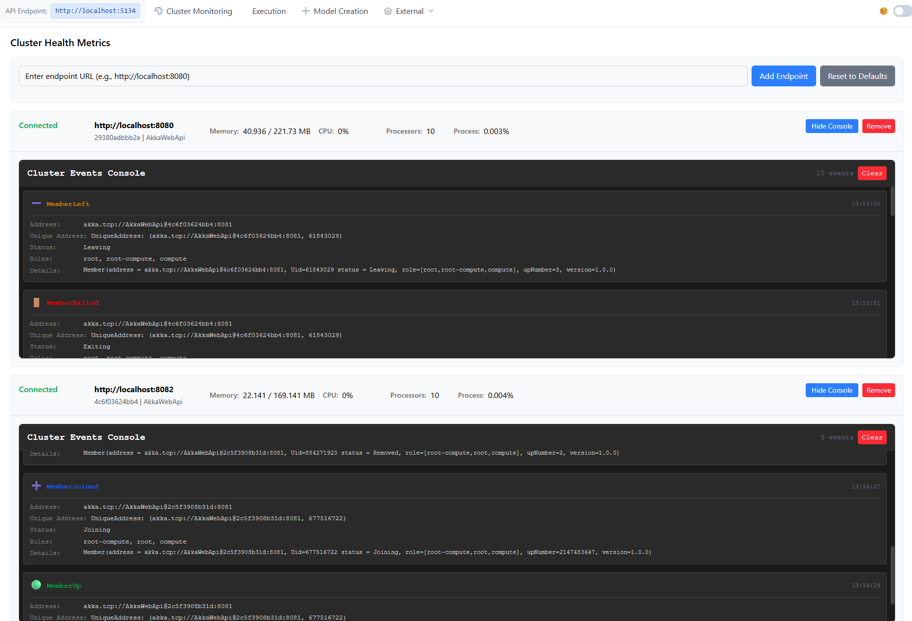
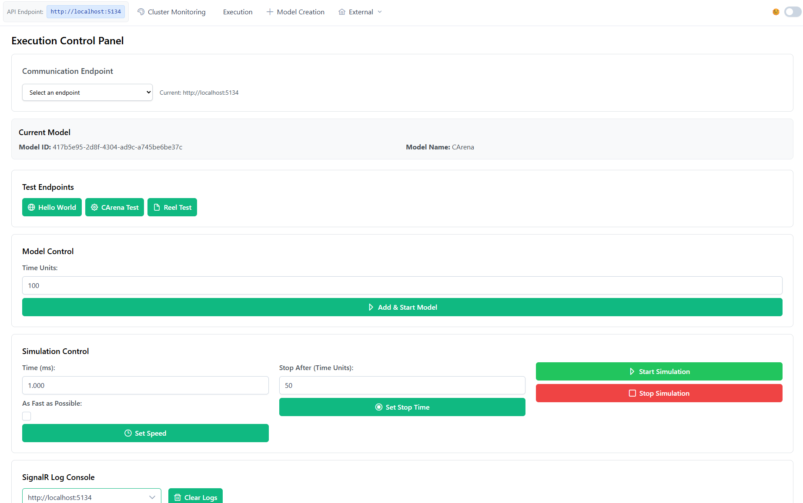
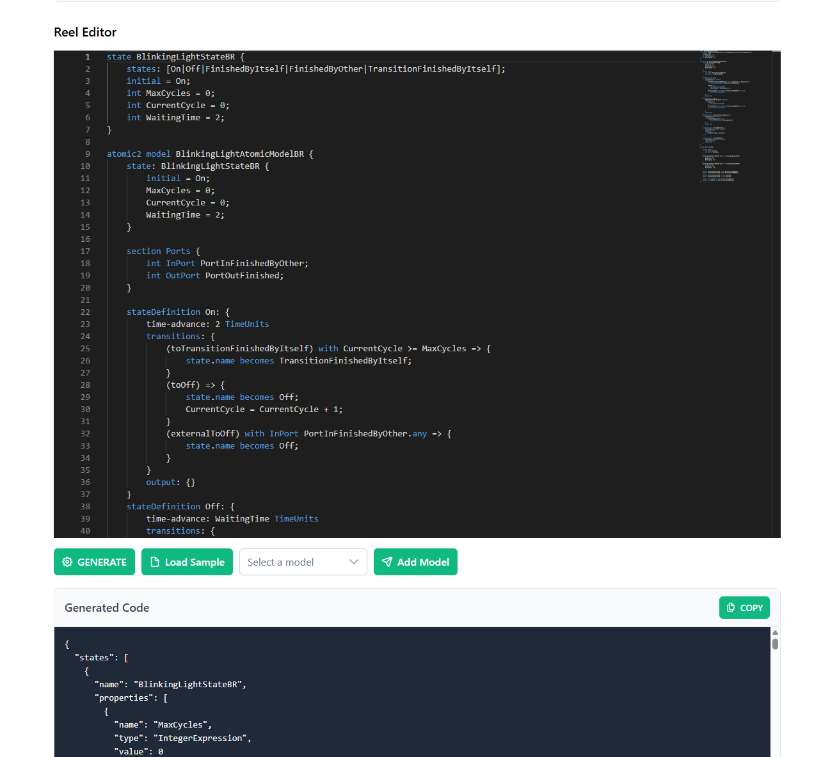
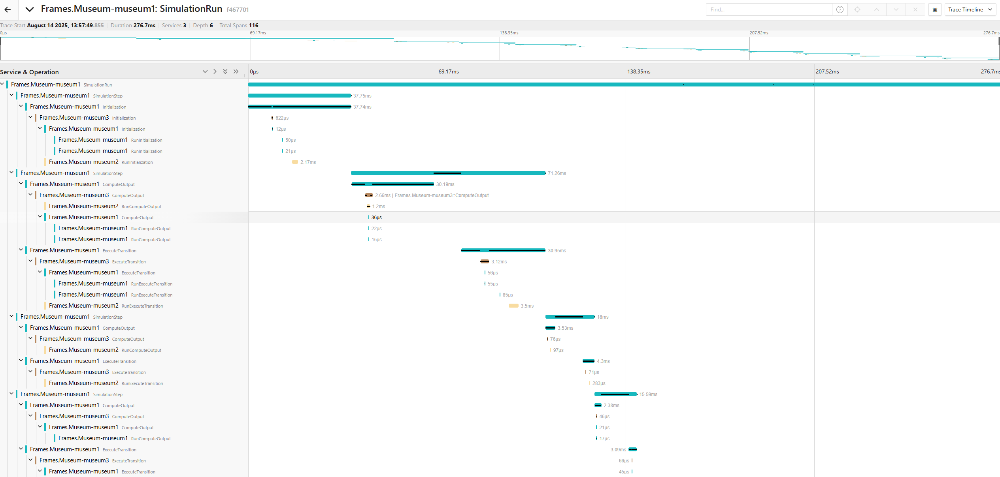

# Master thesis Artifact
This repository contains the artifact developed for the master’s thesis “Frames: A Novel Framework for Parallel DEVS based on Actors.”
Please note that this repository is no longer actively maintained.

For a potentially newer and actively maintained version, refer to the University of Innsbruck QE Repository:
👉 [Frames](https://git.uibk.ac.at/informatik/qe/sim-team/frames)
# Frames

Frames is an actor based parallel DEVS simulation engine.


## Getting started

### Running with docker-compose

1. Execute following command from project root:
````shell
docker build -t frames-museum -f .\Frames.Museum\Dockerfile .
````
2. Run one of the docker-compose in Frames.Museum
3. Start the Frames.Museum.WebApp with ng serve from `package.json` in Frames.Museum.WebApp

### Running locally

#### Prerequisites
Install .net 9 or above
Install Node Version 24 (Recommend nvm or nvm-windows) 


1. Start the docker-compose in Frames.Infrastructure
2. Start Frames.Museum 
```
cd ./Frames.Museum
dotnet run
```
3. Start the Frames.Museum.WebApp with ng serve from `package.json` in Frames.Museum.WebApp


## Features

- Native distributed simulation, due to the actor model.
- Supports Parallel DEVS 
- OpenTelemetry support to monitor the simulation engine (Not intended for end-user monitoring, but actual simulation monitoring)
- Checkpointing
- Tracing
- Termination Condition
- Speed control
- Interaction (Stop/Start/Resume) with the simulation engine


# Core Components

## Frames.Engine
Contains the Akka actor implementation of the parallel devs execution engine. Check the Readme in the directory for an in-detail walkthrough.
Contains the core actor implementation for
* Simulator
* Coordinator
* Root Coordinator

## Frames.Museum
Contains the implementation of the WebApi project that startups the Frames.Engine. This is based on the template project WebApiTemplate, which can be found in this [Repo](https://github.com/akkadotnet/akkadotnet-templates). There are additional actors which monitor performance and output of the Akka.Engine and push the results with WebSockets(SignalR). Additionally it provides endpoints to interact with the engine (Start/Stop/Resume/Initialize/etc). Currently this is used by the WebApp to interact with the Engine.   
Also contains docker-compose, which allow Frames.Museum to run in 1,3 or 5 node cluster setup.

## Frames.Museum.WebApp

Provides an Angular based WebApp, which allows to interact with the REST and SignalR endpoints of Frames.Museum. Allows dynamic adding/removing of nodes when Frames.Museum runs in a cluster configuraiton. Disclaimer: This WebApp is coded with strong AI assistance and acts as a prototype.
### Cluster Metrics

### Execution

### Model Creation from Reel



## Frames.DevStoneAdapter
Contains the implementation of the Devstone models in Frames.Model and C#. Contains the compiled dhrystone library in C++ for Windows and Linux, which then gets loaded by devstone models to simulate load. C++ can be directly loaded in C#.

## Frames.Infrastructure

Contains the additional infrastructure required for Frames. This is the following

* MongoDB: Acts as a custom persistance storage to create snapshots of the execution for checkpoints. This is used to save checkpoints and restore the simulation from checkpoints
* Jaeger: Acts as an OTEL Collector which shows the traces across the actors. This nicely shows the complete simulation cycle of Frames as can be seen in the image below.


## Frames.Tests

Contains unit tests for Frames.Engine and Frames.Model

## Frames.ReelTests

Contains unit tests for the integration of the produced Reel Json.

## Frames.BenchmarkTests

These tests were created during the implementation of the benchmark. They focus on the parsing and execution of the models as defined in Frames.Models in Frames.Engine
They were created to implement the lazy loading of the atomic models. (Previously the whole model tree was evaluated durin from the current model point. This means when a coupled model has deeply nested coupled models, then they all got created.) Now only the current coupled model is evaluated in the respective CoordinatorActor. Unit tests could probably be integrated in Frames.Tests


# Other Components


## Frames.Helper
Currently only contains a html, which takes the output from Frames.Museum.WebApp Execution Log to count the number of internal and external transitions. This was done for the master thesis to verify that devstone was correctly implemented by cross checking with existing devstone literature, which states the supposed number of transitions. 

## Frames.BenchmarkEval
Contains a simple C# Console application to execute Devstone and custom benchmark models against a running Frames.Museum and listen for the signalR output, which tells the application the result. Finally the result is appended in a csv.


